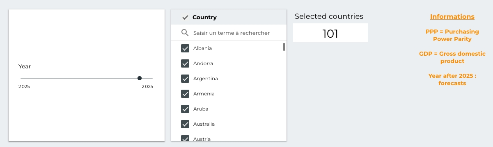
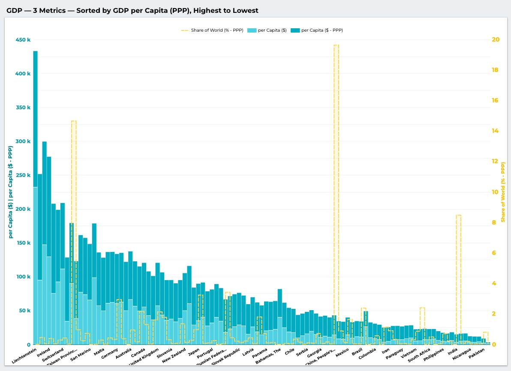
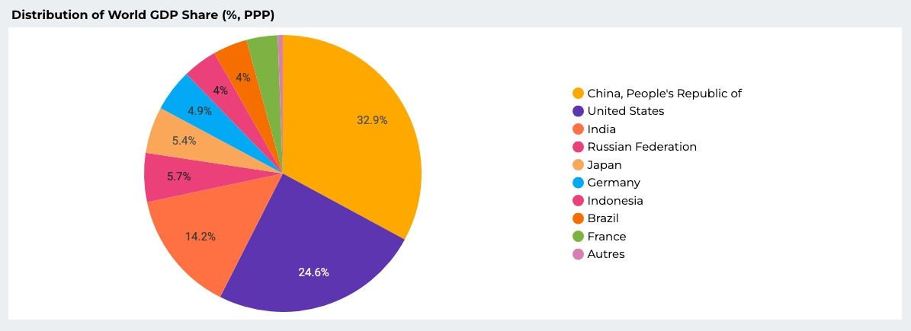
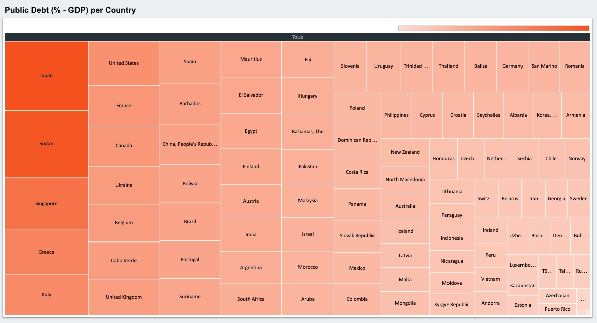

<h1 align="center" style="color:#0B2D5C; font-size: 40px; margin-bottom: 8px;">
  𝙇𝙤𝙤𝙠𝙚𝙧 𝙎𝙩𝙪𝙙𝙞𝙤 𝘿𝙖𝙨𝙝𝙗𝙤𝙖𝙧𝙙
</h1>

## **𝙊𝙫𝙚𝙧𝙫𝙞𝙚𝙬**
This document presents the final visualization layer of the **Ecodata - Cloud** project. 
The dashboard is built in Looker Studio and connects directly to our BigQuery data warehouse, specifically the `ecodatacloud_bq_gold.gold__obt` table.

Because the One Big Table (OBT) is pre-joined, partitioned by `year`, and clustered by `country_label`, the dashboard loads quickly and allows for seamless cross-country comparisons.

---

## **𝘿𝙖𝙨𝙝𝙗𝙤𝙖𝙧𝙙 𝙇𝙞𝙣𝙠**
[Open the live Looker Studio report](https://lookerstudio.google.com/reporting/3541fe0f-2742-4d70-9067-e23942eae419)

---

## **𝙐𝙨𝙖𝙜𝙚 𝙄𝙣𝙨𝙩𝙧𝙪𝙘𝙩𝙞𝙤𝙣𝙨**
- **Filters**: Use the global filters at the top of the dashboard to select specific `years` or isolate specific `country_label` values.
- **Interactivity**: Charts are cross-filtered. Clicking on a specific country in one chart updates the rest of the dashboard for that same selection.

For this short analysis example, the filters are configured as follows:

  
   

---

## **𝙆𝙚𝙮 𝙑𝙞𝙨𝙪𝙖𝙡𝙞𝙯𝙖𝙩𝙞𝙤𝙣𝙨**

### 1. GDP

This section focuses on how to compare economic size and living standards without mixing two different ideas:

| Metric | GDP (total) | GDP per capita |
| --- | --- | --- |
| Main objective | Measure overall economic power | Measure average wealth and living standards |
| Main bias | Favors highly populated countries | Can hide strong internal inequalities |
| Analytical use | Compare macroeconomic weight | Compare relative prosperity between populations |

This section provides a high-level view of the world economy for a selected year. It answers questions like:
- *Which economies generate the most wealth?*

  
   

This question must be analyzed from several angles:

- GDP per capita should be read alongside PPP-adjusted GDP per capita to account for differences in cost of living.
- A country may rank high in total wealth creation while remaining less impressive in per-capita terms.
- The chart helps compare the macroeconomic weight of a country with the relative wealth of its population.

In practice, a country can be very strong at the macroeconomic level while its population is not necessarily among the richest in relative terms. Population size matters a lot here. Liechtenstein stands out in terms of average wealth per person, but its contribution to total world wealth creation remains very small. By contrast, China is closer to the middle of the distribution in GDP per capita, yet its contribution to global wealth creation is extremely large.

### 2. Distribution of GDP Share
This chart focuses on the distribution of world wealth creation through `gdp_ppp_world_share_percent_world`. It highlights how a small number of countries account for a large share of global output.

  

This view makes the concentration of economic power immediately visible. China and the United States dominate the global distribution, which is why they occupy such a central place in the dashboard analysis.

### 3. Public Debt by Country

  

Public debt is a key macroeconomic indicator because it affects future generations, fiscal sustainability, and a country's borrowing capacity. It can suggest that a state is struggling to maintain its standard of living, or, on the contrary, that it is borrowing to finance major investments.

Japan is a useful example in this chart because it combines a mature economy with an unusually high level of public debt. More broadly, debt can also be discussed in terms of sovereignty, since creditors are often not only domestic households or companies, but also foreign institutions and states.

---
