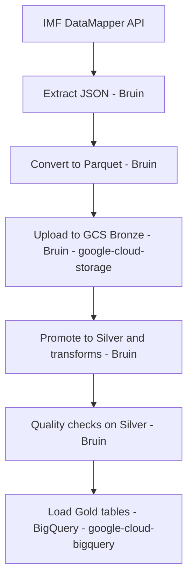

<h1 align="center" style="color:#0B2D5C; font-size: 48px; margin-bottom: 8px;">
  
  𝙀𝙘𝙤𝙙𝙖𝙩𝙖 - 𝘾𝙡𝙤𝙪𝙙
</h1>

  

## **𝙋𝙧𝙤𝙟𝙚𝙘𝙩**

### **𝙀𝙫𝙖𝙡𝙪𝙖𝙩𝙞𝙤𝙣 𝘾𝙧𝙞𝙩𝙚𝙧𝙞𝙖 𝙈𝙖𝙥𝙥𝙞𝙣𝙜 𝙛𝙤𝙧 𝙫𝙖𝙡𝙞𝙙𝙖𝙩𝙞𝙤𝙣 𝙤𝙛 𝙩𝙝𝙚 𝙥𝙧𝙤𝙟𝙚𝙘𝙩**
- Problem description: The project target and data scope are defined in this README.
- Cloud: GCP is used, and all infrastructure is created with Terraform.
- Batch / orchestration: Bruin orchestrates batch assets; runs are triggered via CLI or Makefile.
- Data warehouse: BigQuery dataset is provisioned; partitioning/clustering is applied during gold load.
- Transformations: Bruin-first quality checks; optional SQL models in BigQuery.
- Dashboard: To be implemented with two tiles after warehouse modeling.
- Reproducibility: Makefile and step-by-step instructions are provided below.

## **𝙊𝙫𝙚𝙧𝙫𝙞𝙚𝙬**
This project builds a reproducible data pipeline around IMF DataMapper indicators. The goal is to collect different economic countries datas:

- Inflation
- Gross Domestic Product
- Debt
- Employment
-> store it in a cloud data lake, and prepare it for analysis and dashboards.

This stack is intentionally lightweight: minimal tools, no dbt, and a focus on Python + Bruin + Makefile automation. The goal is to reduce moving parts, keep the pipeline easy to understand and operate, and still leverage Python’s flexibility for transformations/quality checks while Bruin handles orchestration and Makefile keeps runs consistent and reproducible.

What is a Makefile ? 
It is basically a tiny “task runner” that lets us run common project commands with short, memorable names. 
Makefile is better when you have multiple tasks with dependencies and want a standard interface (e.g., make full, make gold-load).
.sh is better for a single long script or when you need more complex logic.

**𝙋𝙧𝙤𝙗𝙡𝙚𝙢**
Provide a clean, repeatable pipeline that aggregates macroeconomic indicators across countries and years, and makes them available for downstream analytics. A key goal is to compare different economic variables between countries (e.g., US vs others) to discover trends.

## **𝙎𝙩𝙖𝙘𝙠**
- Cloud: Google Cloud Platform (GCP)
- IaC: Terraform
- Orchestration: Bruin (CLI-driven batch runs)
- Data lake: Google Cloud Storage (bronze + silver)
- Data warehouse: BigQuery (gold dataset)
- Transformations/Quality: Bruin (Python assets) + optional SQL in BigQuery
- Dashboard: Looker Studio
- Languages: Python, SQL

### **𝘼𝙧𝙘𝙝𝙞𝙩𝙚𝙘𝙩𝙪𝙧𝙚**

  

### **𝘼𝙧𝙘𝙝𝙞𝙩𝙚𝙘𝙩𝙪𝙧𝙚 (𝘽𝙖𝙩𝙘𝙝)**
1. 𝙀𝙭𝙩𝙧𝙖𝙘𝙩 IMF API data into JSON: `data/raw`
2. 𝘾𝙤𝙣𝙫𝙚𝙧𝙩 JSON to Parquet: `data/parquet`
3. 𝙐𝙥𝙡𝙤𝙖𝙙 Parquet to GCS bronze (Bruin + google-cloud-storage): `gs://ecodatacloud-ds-bronze/parquet`
4. 𝙋𝙧𝙤𝙢𝙤𝙩𝙚 Parquet to GCS silver: `gs://ecodatacloud-ds-silver/parquet`
5. 𝙍𝙪𝙣 Bruin data quality checks on silver (GCS)
6. 𝙇𝙤𝙖𝙙 partitioned + clustered gold tables in BigQuery (google-cloud-bigquery)
7. 𝙏𝙧𝙖𝙣𝙨𝙛𝙤𝙧𝙢 into BigQuery tables (gold models) (optional, later)
8. 𝘽𝙪𝙞𝙡𝙙 a dashboard with at least two tiles (planned)

### **𝘽𝙖𝙩𝙘𝙝 𝘿𝘼𝙂**

Each arrow means “this step depends on the previous one”; read the flow from left to right.

### **𝙋𝙖𝙧𝙩𝙞𝙩𝙞𝙤𝙣𝙞𝙣𝙜 & 𝘾𝙡𝙪𝙨𝙩𝙚𝙧𝙞𝙣𝙜 (𝘽𝙞𝙜 𝙌𝙪𝙚𝙧𝙮 - 𝙂𝙤𝙡𝙙 𝙡𝙖𝙮𝙚𝙧)**
Gold tables are created with partitioning and clustering that match typical upstream queries:
1. 𝙋𝙖𝙧𝙩𝙞𝙩𝙞𝙤𝙣 by `year` (range partitioning) to prune scans for time-window queries.
2. 𝘾𝙡𝙪𝙨𝙩𝙚𝙧 by `country` to accelerate country filters and country-level aggregates.
3. 𝙁𝙤𝙧 the `countries` dimension table, we skip partitioning (small table) and cluster by `country` for fast joins.
4. 𝙏𝙝𝙚𝙨𝙚 choices map to expected queries like “trend by country over a time range” and “compare countries by indicator”.

---

## **𝘿𝙤𝙘𝙨**
- `Setup.md`: environment setup, GCP/IAM, and infrastructure provisioning.
- `Quickstart.md`: two complete paths (manual bash or Makefile) to run the pipeline from zero to finish.
- `./data/Dataset.md`: Explain the dataset
- `./data/Transformations.md`: Explain the changes in the silver layer and in the gold layer
