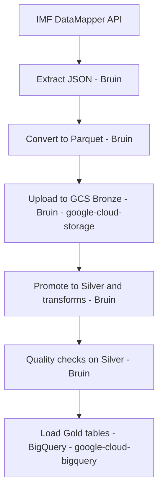

**Overview**
This project builds a reproducible data pipeline around IMF DataMapper indicators. The goal is to collect economic data, store it in a cloud data lake, and prepare it for analysis and dashboards.

**Problem**
Provide a clean, repeatable pipeline that aggregates macroeconomic indicators across countries and years, and makes them available for downstream analytics.

**Stack**
- Cloud: Google Cloud Platform (GCP)
- IaC: Terraform
- Orchestration: Bruin (CLI-driven batch runs)
- Data lake: Google Cloud Storage (bronze + silver)
- Data warehouse: BigQuery (gold dataset)
- Transformations/Quality: Bruin (Python assets) + optional SQL in BigQuery
- Dashboard: Looker Studio or similar (planned)
- Languages: Python, SQL

**Architecture (Batch)**
1. Extract IMF API data into JSON: `data/raw`
2. Convert JSON to Parquet: `data/parquet`
3. Upload Parquet to GCS bronze (Bruin + google-cloud-storage): `gs://ecodatacloud-ds-bronze/parquet`
4. Promote Parquet to GCS silver: `gs://ecodatacloud-ds-silver/parquet`
5. Run Bruin data quality checks on silver (GCS)
6. Load partitioned + clustered gold tables in BigQuery (google-cloud-bigquery)
7. Transform into BigQuery tables (gold models) (optional, later)
8. Build a dashboard with at least two tiles (planned)

**Batch DAG**

Each arrow means “this step depends on the previous one”; read the flow from left to right.

**Partitioning & Clustering (Gold)**
Gold tables are created with partitioning and clustering that match typical upstream queries:
1. Partition by `year` (range partitioning) to prune scans for time-window queries.
2. Cluster by `country` to accelerate country filters and country-level aggregates.
3. For the `countries` dimension table, we skip partitioning (small table) and cluster by `country` for fast joins.
4. These choices map to expected queries like “trend by country over a time range” and “compare countries by indicator”.

**Evaluation Criteria Mapping**
- Problem description: The project target and data scope are defined in this README.
- Cloud: GCP is used, and all infrastructure is created with Terraform.
- Batch / orchestration: Bruin orchestrates batch assets; runs are triggered via CLI or Makefile.
- Data warehouse: BigQuery dataset is provisioned; partitioning/clustering is applied during gold load.
- Transformations: Bruin-first quality checks; optional SQL models in BigQuery.
- Dashboard: To be implemented with two tiles after warehouse modeling.
- Reproducibility: Makefile and step-by-step instructions are provided below.

**Prerequisites**
1. macOS/Linux
2. Google Cloud CLI (`gcloud`)
3. Terraform
4. Bruin CLI
5. Python (optional, only if you want to open the notebook)

**GCP Auth**
1. `gcloud auth application-default login`
2. `gcloud config set project ecodatacloud`
3. `gcloud auth application-default print-access-token`

**IAM Requirements**
The pipeline needs two sets of permissions:
1. User/Owner account (used by Terraform when it manages IAM):
1. `roles/owner` (or equivalent admin permissions)
2. Service account `bruin-ingestor@ecodatacloud.iam.gserviceaccount.com` (used by Bruin assets):
1. `roles/storage.admin`
2. `roles/storage.objectAdmin`
3. `roles/bigquery.dataOwner` (needed for dataset updates)
4. `roles/bigquery.dataEditor`
5. `roles/iam.serviceAccountAdmin`
6. `roles/resourcemanager.projectIamAdmin`
7. `roles/serviceusage.serviceUsageAdmin`

Required APIs (enable once in the project):
1. `serviceusage.googleapis.com`
2. `cloudresourcemanager.googleapis.com`
3. `iam.googleapis.com`
4. `storage.googleapis.com`
5. `bigquery.googleapis.com`

Note: Terraform must be executed with your Owner account (ADC user). The Bruin assets run with the service account.

IAM setup commands (run once with an Owner account):
```bash
gcloud auth login
gcloud config set project ecodatacloud

gcloud projects add-iam-policy-binding ecodatacloud \
  --member=serviceAccount:bruin-ingestor@ecodatacloud.iam.gserviceaccount.com \
  --role=roles/storage.admin

gcloud projects add-iam-policy-binding ecodatacloud \
  --member=serviceAccount:bruin-ingestor@ecodatacloud.iam.gserviceaccount.com \
  --role=roles/storage.objectAdmin

gcloud projects add-iam-policy-binding ecodatacloud \
  --member=serviceAccount:bruin-ingestor@ecodatacloud.iam.gserviceaccount.com \
  --role=roles/bigquery.dataOwner

gcloud projects add-iam-policy-binding ecodatacloud \
  --member=serviceAccount:bruin-ingestor@ecodatacloud.iam.gserviceaccount.com \
  --role=roles/bigquery.dataEditor

gcloud projects add-iam-policy-binding ecodatacloud \
  --member=serviceAccount:bruin-ingestor@ecodatacloud.iam.gserviceaccount.com \
  --role=roles/iam.serviceAccountAdmin

gcloud projects add-iam-policy-binding ecodatacloud \
  --member=serviceAccount:bruin-ingestor@ecodatacloud.iam.gserviceaccount.com \
  --role=roles/resourcemanager.projectIamAdmin

gcloud projects add-iam-policy-binding ecodatacloud \
  --member=serviceAccount:bruin-ingestor@ecodatacloud.iam.gserviceaccount.com \
  --role=roles/serviceusage.serviceUsageAdmin
```

**Billing Requirement**
GCS buckets require an active billing account. If you see:
`Error 403: The billing account for the owning project is disabled`
then link a billing account and re-run Terraform.

**Provision Infrastructure (Terraform)**
1. `cd terraform`
2. `terraform init`
3. `terraform plan`
4. `terraform apply`

This creates:
1. Service account `bruin-ingestor`
2. IAM roles: Storage Object Admin + BigQuery Data Editor
3. Buckets: bronze + silver
4. BigQuery dataset

**Data Ingestion**
1. Extract IMF data into JSON with Bruin:
   `bruin run bruin/pipeline/assets/ingestion/imf_api_extract.py`
2. Convert JSON to Parquet with Bruin:
   `bruin run bruin/pipeline/assets/ingestion/imf_json_to_parquet.py`
3. Upload Parquet to bronze (Bruin):
   `bruin run bruin/pipeline/assets/ingestion/imf_bronze_upload.py`
4. Promote Parquet from bronze to silver:
   `bruin run bruin/pipeline/assets/ingestion/imf_bronze_to_silver.py`
5. Run Bruin quality checks on silver:
   `bruin run bruin/pipeline/assets/ingestion/imf_quality_checks.py`
6. Load gold tables in BigQuery (partitioned + clustered, google-cloud-bigquery):
   `bruin run bruin/pipeline/assets/ingestion/imf_gold_load.py`

**Orchestration (End-to-End)**
1. First run: provision infrastructure with `make provision`.
2. Run the full batch with `make full` (extract → convert → upload → promote).
3. Subsequent runs can use `make full` directly without reprovisioning.
4. Run quality checks with `make quality-checks`.
5. Load gold tables with `make gold-load`.
6. For scheduling, run `make full` then `make quality-checks` + `make gold-load` from a cron job or a managed scheduler (Cloud Scheduler / GitHub Actions).

**Makefile Targets**
- `make auth-check`: verify gcloud and ADC authentication
- `make provision`: Terraform init + apply
- `make bruin-extract`: IMF API extraction to JSON
- `make bruin-convert`: JSON to Parquet conversion
- `make ingest-bronze`: upload Parquet to bronze bucket
- `make promote-silver`: copy bronze parquet objects to the silver bucket
- `make quality-checks`: run Bruin data quality checks on silver -> ecodata_cloud/data/silver/_logs/imf_quality_checks_log.csv to check
- `make gold-load`: load partitioned + clustered gold tables
- `make full`: provision + extract + convert + upload + promote to silver
- `make all`: provision + extract + convert + upload (no silver promotion)

**Tool Equivalents**
- `make auth-check`
  - `gcloud auth application-default print-access-token`
  - `gcloud config get-value project`
- `make provision`
  - `terraform -chdir=terraform init`
  - `terraform -chdir=terraform apply`
- `make bruin-convert`
  - `bruin run bruin/pipeline/assets/ingestion/imf_json_to_parquet.py`
- `make bruin-extract`
  - `bruin run bruin/pipeline/assets/ingestion/imf_api_extract.py`
- `make ingest-bronze`
  - `bruin run bruin/pipeline/assets/ingestion/imf_bronze_upload.py`
- `make promote-silver`
  - `bruin run bruin/pipeline/assets/ingestion/imf_bronze_to_silver.py`
- `make quality-checks`
  - `bruin run bruin/pipeline/assets/ingestion/imf_quality_checks.py`
- `make gold-load`
  - `bruin run bruin/pipeline/assets/ingestion/imf_gold_load.py`

**Notes**
- The notebook `scripts/api_data.ipynb` is kept for exploration; the automated pipeline uses the Bruin asset instead.
- For project context, read `data/raw/context.md`.

**Batch Details (Bruin)**
Batch orchestration is CLI-driven and fully automated via Bruin assets plus a Makefile target:
1. `bruin/pipeline/assets/ingestion/imf_api_extract.py` downloads IMF DataMapper JSON into `data/raw/*` and writes a log at `data/raw/api_download_log.txt`.
2. `bruin/pipeline/assets/ingestion/imf_json_to_parquet.py` converts every JSON file to Parquet under `data/parquet/*` and writes a log at `data/parquet/_logs/imf_json_to_parquet_log.csv`.
3. `bruin/pipeline/assets/ingestion/imf_bronze_upload.py` uploads parquet files to the bronze bucket and writes a log at `data/bronze/_logs/imf_bronze_upload_log.csv`.
4. `bruin/pipeline/assets/ingestion/imf_bronze_to_silver.py` promotes parquet objects from bronze to silver, applying configured drop/rename rules, and writes a log at `data/silver/_logs/imf_bronze_to_silver_log.csv`.
5. `bruin/pipeline/assets/ingestion/imf_quality_checks.py` validates silver Parquet quality and writes a log at `data/silver/_logs/imf_quality_checks_log.csv`.
6. `bruin/pipeline/assets/ingestion/imf_gold_load.py` loads partitioned + clustered gold tables in BigQuery and writes a log at `data/gold/_logs/imf_gold_load_log.csv`.
7. `make full` runs the ingestion batch; quality + gold are `make quality-checks` and `make gold-load`.

**Batch Configuration**
Batch parameters are passed via `BRUIN_VARS` as JSON. Example:
`BRUIN_VARS='{"datasets":["gdp_per_capita_usd"],"periods":["2019","2020"],"dry_run":true,"max_objects":5}'`

Example end-to-end batch configuration:
```bash
BRUIN_VARS='{
  "datasets": ["gdp_per_capita_usd", "public_debt_gdp"],
  "periods": ["2019", "2020"],
  "bronze_bucket": "ecodatacloud-ds-bronze",
  "silver_bucket": "ecodatacloud-ds-silver",
  "prefix": "parquet/",
  "overwrite": false,
  "dry_run": false
}' make full
```

Extraction parameters:
1. `datasets`: list of dataset keys to download.
2. `periods`: list of years to request from IMF (ignored for `countries`).
Available dataset keys: `gdp_per_capita_usd`, `gdp_ppp_world_share`, `gdp_per_capita_ppp`, `unemployment_rate`, `public_debt_gdp`, `inflation_avg_consumer`, `countries`.

Promotion (bronze → silver) parameters:
1. `bronze_bucket`: source bucket name. Default: `ecodatacloud-ds-bronze`.
2. `silver_bucket`: destination bucket name. Default: `ecodatacloud-ds-silver`.
3. `prefix`: object prefix to copy. Default: `parquet/`.
4. `overwrite`: overwrite existing objects in silver. Default: `false`.
5. `dry_run`: log actions without copying. Default: `false`.
6. `max_objects`: limit the number of objects processed (useful for testing).
7. `transform_config`: optional path to a JSON transform config (default: `bruin/pipeline/config/silver_transforms.json`).

Bronze upload parameters:
1. `bronze_bucket`: destination bucket name. Default: `ecodatacloud-ds-bronze`.
2. `prefix`: object prefix to upload under. Default: `parquet/`.
3. `overwrite`: overwrite existing objects in bronze. Default: `false`.
4. `dry_run`: log actions without uploading. Default: `false`.
5. `max_files`: limit the number of parquet files uploaded.
6. `local_parquet_dir`: override local parquet directory (default: `data/parquet`).

Transform configuration file (`bruin/pipeline/config/silver_transforms.json`):
1. `default.drop_columns`: columns to drop for all datasets.
2. `default.rename_columns`: rename map for all datasets.
3. `datasets.<dataset>.drop_columns`: dataset-specific columns to drop.
4. `datasets.<dataset>.rename_columns`: dataset-specific rename map.

Quality checks parameters:
1. `quality_config`: optional path to a JSON quality config (default: `bruin/pipeline/config/quality_checks.json`).
2. `fail_on_error`: fail the run if any dataset violates checks. Default: `true`.
3. `max_objects`: limit the number of datasets validated.

Gold load parameters:
1. `bq_project`: BigQuery project id (defaults to ADC project).
2. `bq_dataset`: BigQuery dataset for gold tables. Default: `ecodatacloud_bq_gold`.
3. `bq_location`: BigQuery location. Default: `EU`.
4. `table_prefix`: prefix for gold tables. Default: `gold__`.
5. `overwrite`: overwrite existing tables. Default: `false`.
6. `write_disposition`: BigQuery write disposition. Default: `WRITE_TRUNCATE`.
7. `create_disposition`: BigQuery create disposition. Default: `CREATE_IF_NEEDED`.
8. `gold_config`: optional path to gold table config (default: `bruin/pipeline/config/gold_tables.json`).

Gold table configuration file (`bruin/pipeline/config/gold_tables.json`):
1. `default.partition_field`: field used for partitioning (default `year`).
2. `default.partition_range`: range settings (`start`, `end`, `interval`).
3. `default.cluster_fields`: list of clustering fields (default `country`).
4. `datasets.<dataset>.partition_field`: override per dataset (use `null` to disable).
5. `datasets.<dataset>.cluster_fields`: override per dataset.
