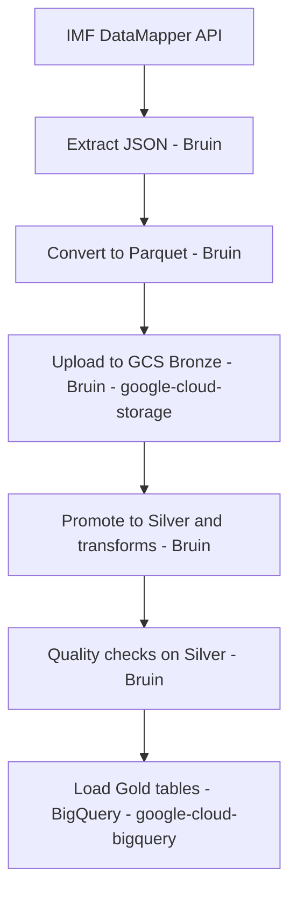

<h1 align="center" style="color:#0B2D5C; font-size: 44px; margin-bottom: 8px;">
  
  <span>𝙀𝙘𝙤𝙙𝙖𝙩𝙖 - 𝘾𝙡𝙤𝙪𝙙</span>
</h1>

<p align="center">
  
</p>

## <span style="color:#0B2D5C;">**𝙋𝙧𝙤𝙟𝙚𝙘𝙩**</span>

### <span style="color:#0B2D5C;">**𝙀𝙫𝙖𝙡𝙪𝙖𝙩𝙞𝙤𝙣 𝘾𝙧𝙞𝙩𝙚𝙧𝙞𝙖 𝙈𝙖𝙥𝙥𝙞𝙣𝙜 𝙛𝙤𝙧 𝙫𝙖𝙡𝙞𝙙𝙖𝙩𝙞𝙤𝙣 𝙤𝙛 𝙩𝙝𝙚 𝙥𝙧𝙤𝙟𝙚𝙘𝙩**</span>
- Problem description: The project target and data scope are defined in this README.
- Cloud: GCP is used, and all infrastructure is created with Terraform.
- Batch / orchestration: Bruin orchestrates batch assets; runs are triggered via CLI or Makefile.
- Data warehouse: BigQuery dataset is provisioned; partitioning/clustering is applied during gold load.
- Transformations: Bruin-first quality checks; optional SQL models in BigQuery.
- Dashboard: To be implemented with two tiles after warehouse modeling.
- Reproducibility: Makefile and step-by-step instructions are provided below.

## <span style="color:#0B2D5C;">**𝙊𝙫𝙚𝙧𝙫𝙞𝙚𝙬**</span>
This project builds a reproducible data pipeline around IMF DataMapper indicators. The goal is to collect different economic countries datas:

- Inflation
- Gross Domestic Product
- Debt
- Employment
-> store it in a cloud data lake, and prepare it for analysis and dashboards.

This stack is intentionally lightweight: minimal tools, no dbt, and a focus on Python + Bruin + Makefile automation. The goal is to reduce moving parts, keep the pipeline easy to understand and operate, and still leverage Python’s flexibility for transformations/quality checks while Bruin handles orchestration and Makefile keeps runs consistent and reproducible.

What is a Makefile ? 
It is basically a tiny “task runner” that lets us run common project commands with short, memorable names. 
Makefile is better when you have multiple tasks with dependencies and want a standard interface (e.g., make full, make gold-load).
.sh is better for a single long script or when you need more complex logic.

<span style="color:#0B2D5C;">**𝙋𝙧𝙤𝙗𝙡𝙚𝙢**</span>
Provide a clean, repeatable pipeline that aggregates macroeconomic indicators across countries and years, and makes them available for downstream analytics. A key goal is to compare different economic variables between countries (e.g., US vs others) to discover trends.

## <span style="color:#0B2D5C;">**𝙎𝙩𝙖𝙘𝙠**</span>
- Cloud: Google Cloud Platform (GCP)
- IaC: Terraform
- Orchestration: Bruin (CLI-driven batch runs)
- Data lake: Google Cloud Storage (bronze + silver)
- Data warehouse: BigQuery (gold dataset)
- Transformations/Quality: Bruin (Python assets) + optional SQL in BigQuery
- Dashboard: Looker Studio
- Languages: Python, SQL

### <span style="color:#0B2D5C;">**𝘼𝙧𝙘𝙝𝙞𝙩𝙚𝙘𝙩𝙪𝙧𝙚**</span>

<p align="center">
  
</p>


### <span style="color:#0B2D5C;">**𝘼𝙧𝙘𝙝𝙞𝙩𝙚𝙘𝙩𝙪𝙧𝙚 (𝘽𝙖𝙩𝙘𝙝)**</span>
1. 𝙀𝙭𝙩𝙧𝙖𝙘𝙩 IMF API data into JSON: `data/raw`
2. 𝘾𝙤𝙣𝙫𝙚𝙧𝙩 JSON to Parquet: `data/parquet`
3. 𝙐𝙥𝙡𝙤𝙖𝙙 Parquet to GCS bronze (Bruin + google-cloud-storage): `gs://ecodatacloud-ds-bronze/parquet`
4. 𝙋𝙧𝙤𝙢𝙤𝙩𝙚 Parquet to GCS silver: `gs://ecodatacloud-ds-silver/parquet`
5. 𝙍𝙪𝙣 Bruin data quality checks on silver (GCS)
6. 𝙇𝙤𝙖𝙙 partitioned + clustered gold tables in BigQuery (google-cloud-bigquery)
7. 𝙏𝙧𝙖𝙣𝙨𝙛𝙤𝙧𝙢 into BigQuery tables (gold models) (optional, later)
8. 𝘽𝙪𝙞𝙡𝙙 a dashboard with at least two tiles (planned)

### <span style="color:#0B2D5C;">**𝘽𝙖𝙩𝙘𝙝 𝘿𝘼𝙂**</span>

Each arrow means “this step depends on the previous one”; read the flow from left to right.

### <span style="color:#0B2D5C;">**𝙋𝙖𝙧𝙩𝙞𝙩𝙞𝙤𝙣𝙞𝙣𝙜 & 𝘾𝙡𝙪𝙨𝙩𝙚𝙧𝙞𝙣𝙜 (𝘽𝙞𝙜 𝙌𝙪𝙚𝙧𝙮 - 𝙂𝙤𝙡𝙙 𝙡𝙖𝙮𝙚𝙧)**</span>
Gold tables are created with partitioning and clustering that match typical upstream queries:
1. 𝙋𝙖𝙧𝙩𝙞𝙩𝙞𝙤𝙣 by `year` (range partitioning) to prune scans for time-window queries.
2. 𝘾𝙡𝙪𝙨𝙩𝙚𝙧 by `country` to accelerate country filters and country-level aggregates.
3. 𝙁𝙤𝙧 the `countries` dimension table, we skip partitioning (small table) and cluster by `country` for fast joins.
4. 𝙏𝙝𝙚𝙨𝙚 choices map to expected queries like “trend by country over a time range” and “compare countries by indicator”.

---

## <span style="color:#0B2D5C;">**𝙎𝙚𝙩𝙪𝙥**</span>
<span style="color:#0B2D5C;">**𝙋𝙧𝙚𝙧𝙚𝙦𝙪𝙞𝙨𝙞𝙩𝙚𝙨**</span>
1. 𝙢𝙖𝙘𝙊𝙎/𝙇𝙞𝙣𝙪𝙭
2. 𝙂𝙤𝙤𝙜𝙡𝙚 𝘾𝙡𝙤𝙪𝙙 𝘾𝙇𝙄 (`gcloud`)
3. 𝙏𝙚𝙧𝙧𝙖𝙛𝙤𝙧𝙢
4. 𝘽𝙧𝙪𝙞𝙣 𝘾𝙇𝙄
5. 𝙋𝙮𝙩𝙝𝙤𝙣 (𝙤𝙥𝙩𝙞𝙤𝙣𝙖𝙡, 𝙤𝙣𝙡𝙮 𝙞𝙛 𝙮𝙤𝙪 𝙬𝙖𝙣𝙩 𝙩𝙤 𝙤𝙥𝙚𝙣 𝙩𝙝𝙚 𝙣𝙤𝙩𝙚𝙗𝙤𝙤𝙠)

<span style="color:#0B2D5C;">**𝙌𝙪𝙞𝙘𝙠𝙨𝙩𝙖𝙧𝙩**</span>
1. 𝙍𝙪𝙣 `make provision`
2. 𝙍𝙪𝙣 `make full`
3. 𝙍𝙪𝙣 `make quality-checks` 𝙖𝙣𝙙 `make gold-load`

<span style="color:#0B2D5C;">**𝙐𝙑 𝙀𝙣𝙫𝙞𝙧𝙤𝙣𝙢𝙚𝙣𝙩 (𝙊𝙥𝙩𝙞𝙤𝙣𝙖𝙡)**</span>
Use `uv` for local development only (Bruin installs its own dependencies per asset):
```bash
uv venv
source .venv/bin/activate
uv pip install -r bruin/pipeline/assets/ingestion/requirements.txt
```

<span style="color:#0B2D5C;">**𝙂𝘾𝙋 𝘼𝙪𝙩𝙝**</span>
1. `gcloud auth application-default login`
2. `gcloud config set project ecodatacloud`
3. `gcloud auth application-default print-access-token`

<span style="color:#0B2D5C;">**𝙄𝘼𝙈 𝙍𝙚𝙦𝙪𝙞𝙧𝙚𝙢𝙚𝙣𝙩𝙨**</span>
The pipeline needs two sets of permissions:

1. User/Owner account (used by Terraform when it manages IAM):
1. `roles/owner` (or equivalent admin permissions)

2. Service account `bruin-ingestor@ecodatacloud.iam.gserviceaccount.com` (used by Bruin assets):
1. `roles/storage.admin`
2. `roles/storage.objectAdmin`
3. `roles/bigquery.dataOwner` (needed for dataset updates)
4. `roles/bigquery.dataEditor`
5. `roles/iam.serviceAccountAdmin`
6. `roles/resourcemanager.projectIamAdmin`
7. `roles/serviceusage.serviceUsageAdmin`

Required APIs (enable once in the project):
1. `serviceusage.googleapis.com`
2. `cloudresourcemanager.googleapis.com`
3. `iam.googleapis.com`
4. `storage.googleapis.com`
5. `bigquery.googleapis.com`

Note: Terraform must be executed with your Owner account (ADC user). The Bruin assets run with the service account.

IAM setup commands (run once with an Owner account):
```bash
gcloud auth login
gcloud config set project ecodatacloud

gcloud projects add-iam-policy-binding ecodatacloud \
  --member=serviceAccount:bruin-ingestor@ecodatacloud.iam.gserviceaccount.com \
  --role=roles/storage.admin

gcloud projects add-iam-policy-binding ecodatacloud \
  --member=serviceAccount:bruin-ingestor@ecodatacloud.iam.gserviceaccount.com \
  --role=roles/storage.objectAdmin

gcloud projects add-iam-policy-binding ecodatacloud \
  --member=serviceAccount:bruin-ingestor@ecodatacloud.iam.gserviceaccount.com \
  --role=roles/bigquery.dataOwner

gcloud projects add-iam-policy-binding ecodatacloud \
  --member=serviceAccount:bruin-ingestor@ecodatacloud.iam.gserviceaccount.com \
  --role=roles/bigquery.dataEditor

gcloud projects add-iam-policy-binding ecodatacloud \
  --member=serviceAccount:bruin-ingestor@ecodatacloud.iam.gserviceaccount.com \
  --role=roles/iam.serviceAccountAdmin

gcloud projects add-iam-policy-binding ecodatacloud \
  --member=serviceAccount:bruin-ingestor@ecodatacloud.iam.gserviceaccount.com \
  --role=roles/resourcemanager.projectIamAdmin

gcloud projects add-iam-policy-binding ecodatacloud \
  --member=serviceAccount:bruin-ingestor@ecodatacloud.iam.gserviceaccount.com \
  --role=roles/serviceusage.serviceUsageAdmin
```

<span style="color:#0B2D5C;">**𝘽𝙞𝙡𝙡𝙞𝙣𝙜 𝙍𝙚𝙦𝙪𝙞𝙧𝙚𝙢𝙚𝙣𝙩**</span>
GCS buckets require an active billing account. If you see:
`Error 403: The billing account for the owning project is disabled`
then link a billing account and re-run Terraform.

<span style="color:#0B2D5C;">**𝙋𝙧𝙤𝙫𝙞𝙨𝙞𝙤𝙣𝙞𝙣𝙜**</span>
<span style="color:#0B2D5C;">**𝙋𝙧𝙤𝙫𝙞𝙨𝙞𝙤𝙣 𝙄𝙣𝙛𝙧𝙖𝙨𝙩𝙧𝙪𝙘𝙩𝙪𝙧𝙚 (𝙏𝙚𝙧𝙧𝙖𝙛𝙤𝙧𝙢)**</span>
1. 𝙘𝙙 `terraform`
2. 𝙧𝙪𝙣 `terraform init`
3. 𝙧𝙪𝙣 `terraform plan`
4. 𝙧𝙪𝙣 `terraform apply`

Alternative: `make provision` runs `terraform init` + `terraform plan` + `terraform apply`.

This creates:
1. Service account `bruin-ingestor`
2. IAM roles: Storage Object Admin + BigQuery Data Editor
3. Buckets: bronze + silver
4. BigQuery dataset

<span style="color:#0B2D5C;">**𝙋𝙞𝙥𝙚𝙡𝙞𝙣𝙚 𝙍𝙪𝙣𝙗𝙤𝙤𝙠**</span>
<span style="color:#0B2D5C;">**𝘿𝙖𝙩𝙖 𝙄𝙣𝙜𝙚𝙨𝙩𝙞𝙤𝙣**</span>
1. 𝙀𝙭𝙩𝙧𝙖𝙘𝙩 IMF data into JSON with Bruin:
   `bruin run bruin/pipeline/assets/ingestion/imf_api_extract.py`
2. 𝘾𝙤𝙣𝙫𝙚𝙧𝙩 JSON to Parquet with Bruin:
   `bruin run bruin/pipeline/assets/ingestion/imf_json_to_parquet.py`
3. 𝙐𝙥𝙡𝙤𝙖𝙙 Parquet to bronze (Bruin):
   `bruin run bruin/pipeline/assets/ingestion/imf_bronze_upload.py`
4. 𝙋𝙧𝙤𝙢𝙤𝙩𝙚 Parquet from bronze to silver:
   `bruin run bruin/pipeline/assets/ingestion/imf_bronze_to_silver.py`
5. 𝙍𝙪𝙣 Bruin quality checks on silver:
   `bruin run bruin/pipeline/assets/ingestion/imf_quality_checks.py`
6. 𝙇𝙤𝙖𝙙 gold tables in BigQuery (partitioned + clustered, google-cloud-bigquery):
   `bruin run bruin/pipeline/assets/ingestion/imf_gold_load.py`

<span style="color:#0B2D5C;">**𝙊𝙧𝙘𝙝𝙚𝙨𝙩𝙧𝙖𝙩𝙞𝙤𝙣 (𝙀𝙣𝙙-𝙩𝙤-𝙀𝙣𝙙)**</span>
1. 𝙁𝙞𝙧𝙨𝙩 run: provision infrastructure with `make provision`.
2. 𝙍𝙪𝙣 the full batch with `make full` (extract → convert → upload → promote).
3. 𝙎𝙪𝙗𝙨𝙚𝙦𝙪𝙚𝙣𝙩 runs can use `make full` directly without reprovisioning.
4. 𝙍𝙪𝙣 quality checks with `make quality-checks`.
5. 𝙇𝙤𝙖𝙙 gold tables with `make gold-load`.
6. 𝙁𝙤𝙧 scheduling, run `make full` then `make quality-checks` + `make gold-load` from a cron job or a managed scheduler (Cloud Scheduler / GitHub Actions).

<span style="color:#0B2D5C;">**𝙁𝙪𝙡𝙡 𝙍𝙪𝙣 𝘼𝙡𝙩𝙚𝙧𝙣𝙖𝙩𝙞𝙫𝙚𝙨**</span>
1. 𝙁𝙪𝙡𝙡 𝙈𝙖𝙣𝙪𝙖𝙡:
```bash
terraform init
terraform plan
terraform apply
bruin run bruin/pipeline/assets/ingestion/imf_api_extract.py
bruin run bruin/pipeline/assets/ingestion/imf_json_to_parquet.py
bruin run bruin/pipeline/assets/ingestion/imf_bronze_upload.py
bruin run bruin/pipeline/assets/ingestion/imf_bronze_to_silver.py
bruin run bruin/pipeline/assets/ingestion/imf_quality_checks.py
bruin run bruin/pipeline/assets/ingestion/imf_gold_load.py
```
2. 𝙁𝙪𝙡𝙡 𝙈𝙖𝙠𝙚:
```bash
make provision
make full
make quality-checks
make gold-load
```

<span style="color:#0B2D5C;">**𝙈𝙖𝙠𝙚𝙛𝙞𝙡𝙚 𝙏𝙖𝙧𝙜𝙚𝙩𝙨**</span>
- `make auth-check`: verify gcloud and ADC authentication
- `make provision`: Terraform init + plan + apply
- `make bruin-extract`: IMF API extraction to JSON
- `make bruin-convert`: JSON to Parquet conversion
- `make ingest-bronze`: upload Parquet to bronze bucket
- `make promote-silver`: copy bronze parquet objects to the silver bucket
- `make quality-checks`: run Bruin data quality checks on silver -> ecodata_cloud/data/silver/_logs/imf_quality_checks_log.csv to check
- `make gold-load`: load partitioned + clustered gold tables
- `make full`: provision + extract + convert + upload + promote to silver
- `make init-to-bronze`: provision + extract + convert + upload (no silver promotion)

<span style="color:#0B2D5C;">**𝙏𝙤𝙤𝙡 𝙀𝙦𝙪𝙞𝙫𝙖𝙡𝙚𝙣𝙩𝙨**</span>
- `make auth-check`
  - `gcloud auth application-default print-access-token`
  - `gcloud config get-value project`
- `make provision`
  - `terraform -chdir=terraform init`
  - `terraform -chdir=terraform plan`
  - `terraform -chdir=terraform apply`
- `make bruin-convert`
  - `bruin run bruin/pipeline/assets/ingestion/imf_json_to_parquet.py`
- `make bruin-extract`
  - `bruin run bruin/pipeline/assets/ingestion/imf_api_extract.py`
- `make ingest-bronze`
  - `bruin run bruin/pipeline/assets/ingestion/imf_bronze_upload.py`
- `make promote-silver`
  - `bruin run bruin/pipeline/assets/ingestion/imf_bronze_to_silver.py`
- `make quality-checks`
  - `bruin run bruin/pipeline/assets/ingestion/imf_quality_checks.py`
- `make gold-load`
  - `bruin run bruin/pipeline/assets/ingestion/imf_gold_load.py`

<span style="color:#0B2D5C;">**𝙉𝙤𝙩𝙚𝙨**</span>
- The notebook `scripts/api_data.ipynb` is kept for exploration; the automated pipeline uses the Bruin asset instead.
- For project context, read `data/raw/context.md`.

<span style="color:#0B2D5C;">**𝘾𝙤𝙣𝙛𝙞𝙜𝙪𝙧𝙖𝙩𝙞𝙤𝙣**</span>
<span style="color:#0B2D5C;">**𝘽𝙖𝙩𝙘𝙝 𝘿𝙚𝙩𝙖𝙞𝙡𝙨 (𝘽𝙧𝙪𝙞𝙣)**</span>
Batch orchestration is CLI-driven and fully automated via Bruin assets plus a Makefile target:
1. `bruin/pipeline/assets/ingestion/imf_api_extract.py` 𝙙𝙤𝙬𝙣𝙡𝙤𝙖𝙙𝙨 IMF DataMapper JSON into `data/raw/*` and writes a log at `data/raw/api_download_log.txt`.
2. `bruin/pipeline/assets/ingestion/imf_json_to_parquet.py` 𝙘𝙤𝙣𝙫𝙚𝙧𝙩𝙨 every JSON file to Parquet under `data/parquet/*` and writes a log at `data/parquet/_logs/imf_json_to_parquet_log.csv`.
3. `bruin/pipeline/assets/ingestion/imf_bronze_upload.py` 𝙪𝙥𝙡𝙤𝙖𝙙𝙨 parquet files to the bronze bucket and writes a log at `data/bronze/_logs/imf_bronze_upload_log.csv`.
4. `bruin/pipeline/assets/ingestion/imf_bronze_to_silver.py` 𝙥𝙧𝙤𝙢𝙤𝙩𝙚𝙨 parquet objects from bronze to silver, applying configured drop/rename rules, and writes a log at `data/silver/_logs/imf_bronze_to_silver_log.csv`.
5. `bruin/pipeline/assets/ingestion/imf_quality_checks.py` 𝙫𝙖𝙡𝙞𝙙𝙖𝙩𝙚𝙨 silver Parquet quality and writes a log at `data/silver/_logs/imf_quality_checks_log.csv`.
6. `bruin/pipeline/assets/ingestion/imf_gold_load.py` 𝙡𝙤𝙖𝙙𝙨 partitioned + clustered gold tables in BigQuery and writes a log at `data/gold/_logs/imf_gold_load_log.csv`.
7. `make full` 𝙧𝙪𝙣𝙨 the ingestion batch; quality + gold are `make quality-checks` and `make gold-load`.

<span style="color:#0B2D5C;">**𝘽𝙖𝙩𝙘𝙝 𝘾𝙤𝙣𝙛𝙞𝙜𝙪𝙧𝙖𝙩𝙞𝙤𝙣**</span>
Batch parameters are passed via `BRUIN_VARS` as JSON. Example:
`BRUIN_VARS='{"datasets":["gdp_per_capita_usd"],"periods":["2019","2020"],"dry_run":true,"max_objects":5}'`

Using `make` with BRUIN_VARS:
`BRUIN_VARS='{"datasets":["gdp_per_capita_usd"],"periods":["2019","2020"]}' make full`

Examples:
```bash
# Full run with a subset of datasets/years
BRUIN_VARS='{"datasets":["gdp_per_capita_usd"],"periods":["2020"]}' make full

# Quick quality check test
BRUIN_VARS='{"dry_run":true,"max_objects":3}' make quality-checks

# Force overwrite during bronze -> silver
BRUIN_VARS='{"overwrite":true}' make promote-silver
```

<span style="color:#0B2D5C;">**𝘾𝙤𝙣𝙛𝙞𝙜𝙪𝙧𝙖𝙩𝙞𝙤𝙣 & 𝙇𝙤𝙜𝙨 𝙇𝙤𝙘𝙖𝙩𝙞𝙤𝙣𝙨**</span>
Configuration files:
- Silver transforms: `bruin/pipeline/config/silver_transforms.json`
- Data quality checks: `bruin/pipeline/config/quality_checks.json`
- Gold tables (partition/clustering): `bruin/pipeline/config/gold_tables.json`

Logs (generated at runtime):
- API extract log: `data/raw/api_download_log.txt`
- JSON → Parquet log: `data/parquet/_logs/imf_json_to_parquet_log.csv`
- Bronze upload log: `data/bronze/_logs/imf_bronze_upload_log.csv`
- Bronze → Silver log: `data/silver/_logs/imf_bronze_to_silver_log.csv`
- Quality checks log: `data/silver/_logs/imf_quality_checks_log.csv`
- Gold load log: `data/gold/_logs/imf_gold_load_log.csv`

𝙁𝙞𝙡𝙚𝙨 → 𝙋𝙪𝙧𝙥𝙤𝙨𝙚:
- `bruin/pipeline/assets/ingestion/imf_api_extract.py`: pull IMF data to `data/raw/*` + log `data/raw/api_download_log.txt`
- `bruin/pipeline/assets/ingestion/imf_json_to_parquet.py`: convert JSON to `data/parquet/*` + log `data/parquet/_logs/imf_json_to_parquet_log.csv`
- `bruin/pipeline/assets/ingestion/imf_bronze_upload.py`: upload parquet to `gs://ecodatacloud-ds-bronze/parquet/*` + log `data/bronze/_logs/imf_bronze_upload_log.csv`
- `bruin/pipeline/assets/ingestion/imf_bronze_to_silver.py`: promote bronze → `gs://ecodatacloud-ds-silver/parquet/*` + log `data/silver/_logs/imf_bronze_to_silver_log.csv`
- `bruin/pipeline/assets/ingestion/imf_quality_checks.py`: validate silver parquet + log `data/silver/_logs/imf_quality_checks_log.csv`
- `bruin/pipeline/assets/ingestion/imf_gold_load.py`: load gold tables in BigQuery + log `data/gold/_logs/imf_gold_load_log.csv`

𝙈𝙞𝙣𝙞 𝙩𝙖𝙗𝙡𝙚 (𝙎𝙩𝙚𝙥 / 𝙁𝙞𝙡𝙚 / 𝙄𝙣𝙥𝙪𝙩 / 𝙊𝙪𝙩𝙥𝙪𝙩):
| Step | File | Input | Output |
| --- | --- | --- | --- |
| Extract | `bruin/pipeline/assets/ingestion/imf_api_extract.py` | IMF API | `data/raw/*` + `data/raw/api_download_log.txt` |
| Convert | `bruin/pipeline/assets/ingestion/imf_json_to_parquet.py` | `data/raw/*` | `data/parquet/*` + `data/parquet/_logs/imf_json_to_parquet_log.csv` |
| Bronze upload | `bruin/pipeline/assets/ingestion/imf_bronze_upload.py` | `data/parquet/*` | `gs://ecodatacloud-ds-bronze/parquet/*` + `data/bronze/_logs/imf_bronze_upload_log.csv` |
| Silver promote | `bruin/pipeline/assets/ingestion/imf_bronze_to_silver.py` | `gs://ecodatacloud-ds-bronze/parquet/*` | `gs://ecodatacloud-ds-silver/parquet/*` + `data/silver/_logs/imf_bronze_to_silver_log.csv` |
| Quality checks | `bruin/pipeline/assets/ingestion/imf_quality_checks.py` | `gs://ecodatacloud-ds-silver/parquet/*` | `data/silver/_logs/imf_quality_checks_log.csv` |
| Gold load | `bruin/pipeline/assets/ingestion/imf_gold_load.py` | `gs://ecodatacloud-ds-silver/parquet/*` | BigQuery `ecodatacloud_bq_gold.gold__*` + `data/gold/_logs/imf_gold_load_log.csv` |

Example end-to-end batch configuration:
```bash
BRUIN_VARS='{
  "datasets": ["gdp_per_capita_usd", "public_debt_gdp"],
  "periods": ["2019", "2020"],
  "bronze_bucket": "ecodatacloud-ds-bronze",
  "silver_bucket": "ecodatacloud-ds-silver",
  "prefix": "parquet/",
  "overwrite": false,
  "dry_run": false
}' make full
```

Extraction parameters:
1. `datasets`: list of dataset keys to download.
2. `periods`: list of years to request from IMF (ignored for `countries`).
Available dataset keys: `gdp_per_capita_usd`, `gdp_ppp_world_share`, `gdp_per_capita_ppp`, `unemployment_rate`, `public_debt_gdp`, `inflation_avg_consumer`, `countries`.

Promotion (bronze → silver) parameters:
1. `bronze_bucket`: source bucket name. Default: `ecodatacloud-ds-bronze`.
2. `silver_bucket`: destination bucket name. Default: `ecodatacloud-ds-silver`.
3. `prefix`: object prefix to copy. Default: `parquet/`.
4. `overwrite`: overwrite existing objects in silver. Default: `false`.
5. `dry_run`: log actions without copying. Default: `false`.
6. `max_objects`: limit the number of objects processed (useful for testing).
7. `transform_config`: optional path to a JSON transform config (default: `bruin/pipeline/config/silver_transforms.json`).

Bronze upload parameters:
1. `bronze_bucket`: destination bucket name. Default: `ecodatacloud-ds-bronze`.
2. `prefix`: object prefix to upload under. Default: `parquet/`.
3. `overwrite`: overwrite existing objects in bronze. Default: `false`.
4. `dry_run`: log actions without uploading. Default: `false`.
5. `max_files`: limit the number of parquet files uploaded.
6. `local_parquet_dir`: override local parquet directory (default: `data/parquet`).

Transform configuration file (`bruin/pipeline/config/silver_transforms.json`):
1. `default.drop_columns`: columns to drop for all datasets.
2. `default.rename_columns`: rename map for all datasets.
3. `datasets.<dataset>.drop_columns`: dataset-specific columns to drop.
4. `datasets.<dataset>.rename_columns`: dataset-specific rename map.

Quality checks parameters:
1. `quality_config`: optional path to a JSON quality config (default: `bruin/pipeline/config/quality_checks.json`).
2. `fail_on_error`: fail the run if any dataset violates checks. Default: `true`.
3. `max_objects`: limit the number of datasets validated.

Gold load parameters:
1. `bq_project`: BigQuery project id (defaults to ADC project).
2. `bq_dataset`: BigQuery dataset for gold tables. Default: `ecodatacloud_bq_gold`.
3. `bq_location`: BigQuery location. Default: `EU`.
4. `table_prefix`: prefix for gold tables. Default: `gold__`.
5. `overwrite`: overwrite existing tables. Default: `false`.
6. `write_disposition`: BigQuery write disposition. Default: `WRITE_TRUNCATE`.
7. `create_disposition`: BigQuery create disposition. Default: `CREATE_IF_NEEDED`.
8. `gold_config`: optional path to gold table config (default: `bruin/pipeline/config/gold_tables.json`).

Gold table configuration file (`bruin/pipeline/config/gold_tables.json`):
1. `default.partition_field`: field used for partitioning (default `year`).
2. `default.partition_range`: range settings (`start`, `end`, `interval`).
3. `default.cluster_fields`: list of clustering fields (default `country`).
4. `datasets.<dataset>.partition_field`: override per dataset (use `null` to disable).
5. `datasets.<dataset>.cluster_fields`: override per dataset.
