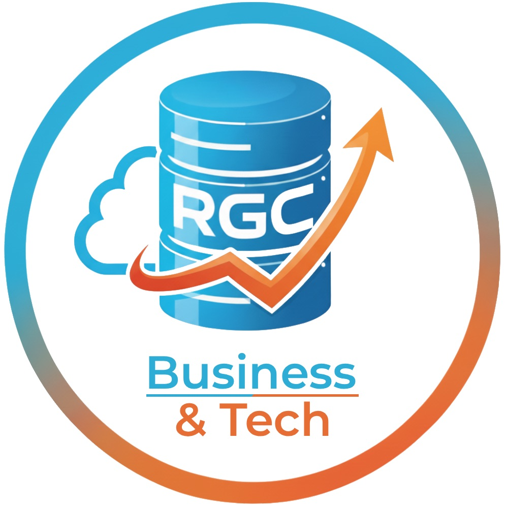
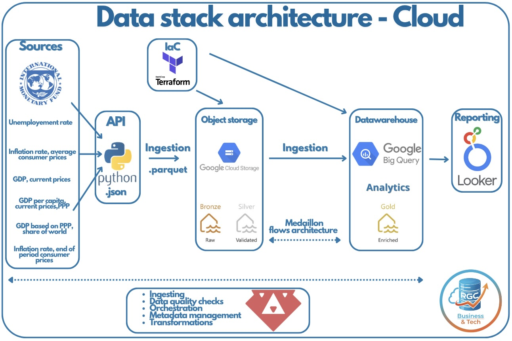
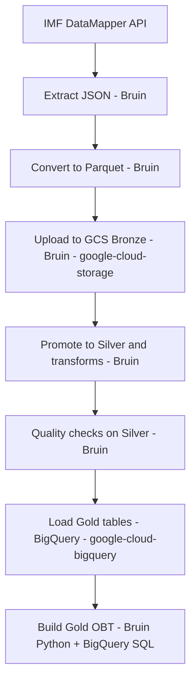

<h1 align="center" style="color:#0B2D5C; font-size: 48px; margin-bottom: 8px;">
  
  𝙀𝙘𝙤𝙙𝙖𝙩𝙖 - 𝘾𝙡𝙤𝙪𝙙
</h1>

  

## **𝙋𝙧𝙤𝙟𝙚𝙘𝙩**

## **𝙊𝙫𝙚𝙧𝙫𝙞𝙚𝙬**
This project builds a reproducible data pipeline around IMF DataMapper indicators. The goal is to collect different economic countries datas:

- Inflation
- Gross Domestic Product
- Debt
- Employment
-> store it in a cloud data lake, and prepare it for analysis and dashboards.

This stack is intentionally lightweight: minimal tools, no dbt, and a focus on Python + Bruin + Makefile automation. The goal is to reduce moving parts, keep the pipeline easy to understand and operate, and still leverage Python’s flexibility for transformations/quality checks while Bruin handles orchestration and Makefile keeps runs consistent and reproducible.

What is a Makefile ? 
It is basically a tiny “task runner” that lets us run common project commands with short, memorable names. 
Makefile is better when you have multiple tasks with dependencies and want a standard interface (e.g., make full, make gold-full).
.sh is better for a single long script or when you need more complex logic.

**𝙋𝙧𝙤𝙗𝙡𝙚𝙢**
Provide a clean, repeatable pipeline that aggregates macroeconomic indicators across countries and years, and makes them available for downstream analytics. A key goal is to compare different economic variables between countries (e.g., US vs others) to discover trends.

# **𝘼𝙧𝙘𝙝𝙞𝙩𝙚𝙘𝙩𝙪𝙧𝙚**

  

## **𝙎𝙩𝙖𝙘𝙠**
- Cloud: Google Cloud Platform (GCP)
- IaC: Terraform
- Orchestration: Bruin (CLI-driven batch runs)
- Data lake: Google Cloud Storage (bronze + silver)
- Data warehouse: BigQuery (gold dataset)
- Transformations/Quality: Bruin (Python assets) + BigQuery SQL for the Gold OBT query
- Dashboard: Looker Studio
- Languages: Python, SQL

## **𝙈𝙮 𝘾𝙝𝙤𝙞𝙘𝙚 - 𝙒𝙝𝙮 𝙏𝙝𝙚𝙨𝙚 𝙏𝙤𝙤𝙡𝙨?**
This project is intentionally designed around a lightweight, low-friction stack. The goal is not to accumulate many specialized tools, but to keep a coherent architecture where each component has a clear role and the overall developer experience stays simple.

### **𝙅𝙪𝙧𝙮-𝙁𝙧𝙞𝙚𝙣𝙙𝙡𝙮 𝙎𝙪𝙢𝙢𝙖𝙧𝙮**
The table below summarizes the design logic of the stack in a compact way.

| Need | Chosen tool | Why this choice | Alternative tools not selected |
| --- | --- | --- | --- |
| End-to-end batch data pipeline | `Bruin` | One framework for ingestion, transformations, and quality checks; reduces stack fragmentation | `dbt` + `Airbyte` + `Great Expectations` as separate tools |
| Cloud infrastructure reproducibility | `Terraform` | Infrastructure is versioned, repeatable, and auditable | Manual GCP console setup |
| Data lake storage | `Google Cloud Storage` | Simple, cheap, file-oriented, and a natural fit for Bronze/Silver layers | local filesystem only, S3/Azure Blob in another cloud |
| Analytical warehouse | `BigQuery` | Serverless SQL warehouse, easy to load from parquet, supports partitioning/clustering | self-managed warehouse, duckdb used as an analytical store |
| Flexible transformation logic | `Python` | Good for APIs, file handling, enrichment, and custom quality logic | notebooks in production, shell-only scripts |
| Final analytical model | `SQL` | Best language for readable joins and business-facing warehouse logic | doing all modeling in Python |
| Reproducible command interface | `Makefile` | Short commands, standardized execution order, easier demos and reruns | long manual command lists, ad hoc `.sh` scripts only |
| BI layer | `Looker Studio` | Native fit with BigQuery, fast to prototype, simple for presentation | heavier BI setup for a small project |

### **𝘽𝙧𝙪𝙞𝙣**
Bruin is the central tool of the project because it combines ingestion, transformations, and data quality in a single framework. This was the main reason for choosing it over a more fragmented modern data stack.

According to Bruin's official positioning, it is an end-to-end data framework for ingestion, transformations, and quality. A good summary of their positioning is: if `dbt`, `Airbyte`, and `Great Expectations` had a common child, it would look like Bruin.

In practical terms, Bruin allows this project to cover several jobs that are often split across multiple tools:
- Data ingestion with Python assets and ingestion connectors
- SQL and Python transformations inside the same pipeline
- Built-in data quality checks
- Dependency-aware pipeline execution
- Lightweight lineage and metadata documentation

For this reason, Bruin can replace or partially replace several popular tools depending on the use case:

| Task | What Bruin does in this project | Popular tools Bruin can replace or reduce |
| --- | --- | --- |
| Data ingestion | Extract IMF data and move files across the lake | `Airbyte`, `dlt`, `Meltano`, custom ETL scripts |
| SQL transformations | Build warehouse-ready tables and the OBT | `dbt Core`, `Dataform`, `SQLMesh` |
| Python transformations | API extraction, file normalization, enrichment, custom logic | notebooks in production, custom ETL scripts, part of `Dagster`/`Prefect` Python jobs |
| Data quality | Run checks on Silver data before Gold load | `Great Expectations`, `Soda`, part of `dbt tests` |
| Workflow execution | Chain multiple batch steps in one reproducible run | part of `Airflow`, `Dagster`, `Prefect`, cron-based scripts |
| Documentation / lineage | Keep the pipeline understandable and navigable | part of `dbt docs`, lightweight local cataloging/documentation |

The important nuance is that Bruin does not replace every data tool completely. It is very strong for batch-oriented data engineering workflows, but it is not intended to replace streaming systems such as `Kafka`, distributed compute engines such as `Spark`, or enterprise-wide governance platforms such as `DataHub` or `Collibra`.

### **𝙂𝘾𝙋**
`GCP` was chosen because it provides a simple and coherent environment for this project:
- `Google Cloud Storage` is a natural fit for Bronze and Silver layers
- `BigQuery` is a serverless warehouse that works well for analytical tables and SQL modeling
- IAM, service accounts, and project services are easy to provision with Terraform

This cloud choice keeps the architecture simple and avoids unnecessary infrastructure management.

### **𝙏𝙚𝙧𝙧𝙖𝙛𝙤𝙧𝙢**
`Terraform` was selected because reproducibility is part of the evaluation criteria and because infrastructure should be versioned like code.

It allows the project to define and recreate:
- buckets
- BigQuery dataset
- IAM roles
- required GCP APIs
- service account configuration

Compared to manual setup in the cloud console, Terraform makes the deployment repeatable, auditable, and easier to review.

### **𝙂𝙤𝙤𝙜𝙡𝙚 𝘾𝙡𝙤𝙪𝙙 𝙎𝙩𝙤𝙧𝙖𝙜𝙚**
`Google Cloud Storage` is used as the data lake because it is simple, cheap, and perfectly adapted to file-based batch pipelines.

It fits the project well because:
- Bronze stores the raw extracted parquet files
- Silver stores transformed parquet files ready for validation and warehouse loading
- storage and compute are decoupled

This keeps the lake layer transparent and easy to inspect.

### **𝘽𝙞𝙜𝙌𝙪𝙚𝙧𝙮**
`BigQuery` was chosen for the Gold layer because it is serverless, SQL-native, and well adapted to analytics workloads.

It is especially relevant here because:
- Gold tables are loaded directly from parquet files
- tables can be partitioned by `year`
- tables can be clustered by `country` or `country_label`
- the final One Big Table can be queried immediately for BI use cases

Compared with a self-managed warehouse, BigQuery reduces operational complexity while still supporting good analytical performance patterns.

### **𝙋𝙮𝙩𝙝𝙤𝙣**
`Python` is used where flexibility matters most:
- calling the IMF API
- parsing JSON payloads
- generating parquet files
- applying custom Silver transformations
- enforcing project-specific quality logic
- orchestrating the final Gold OBT creation when SQL alone is not enough for execution control

Python was preferred over notebooks or shell-heavy pipelines because it is easier to version, test, reuse, and productionize.

### **𝙎𝙌𝙇**
`SQL` is used for the final analytical modeling layer because the business output of the project is relational and query-oriented.

SQL is the right tool here to:
- express the final join logic for the One Big Table
- keep the Gold model easy to audit
- make the final warehouse logic readable for analytics users

Python handles procedural logic; SQL handles analytical modeling.

### **𝙈𝙖𝙠𝙚𝙛𝙞𝙡𝙚**
The `Makefile` is used as the top-level run interface for developers and evaluators.

It is useful because it:
- exposes short and memorable commands such as `make full`, `make quality-checks`, and `make gold-full`
- reduces setup mistakes
- standardizes the order of execution
- makes the project easier to demo and easier to rerun from scratch

For this project, the Makefile plays the role of a lightweight task runner instead of introducing an extra orchestration or scripting layer.

### **𝙇𝙤𝙤𝙠𝙚𝙧 𝙎𝙩𝙪𝙙𝙞𝙤**
`Looker Studio` is the planned dashboard layer because it connects easily to BigQuery and is a natural BI choice in a GCP-based project.

It is relevant for the final step because:
- it requires very little setup
- it supports fast dashboard prototyping
- it allows the Gold OBT to be consumed directly by business-facing charts

This makes it a good fit for a student or portfolio-style data project where speed and clarity matter.

### **𝘼𝙧𝙘𝙝𝙞𝙩𝙚𝙘𝙩𝙪𝙧𝙚 (𝘽𝙖𝙩𝙘𝙝)**
1. 𝙀𝙭𝙩𝙧𝙖𝙘𝙩 IMF API data into JSON: `data/raw`
2. 𝘾𝙤𝙣𝙫𝙚𝙧𝙩 JSON to Parquet: `data/parquet`
3. 𝙐𝙥𝙡𝙤𝙖𝙙 Parquet to GCS bronze (Bruin + google-cloud-storage): `gs://ecodatacloud-ds-bronze/parquet`
4. 𝙋𝙧𝙤𝙢𝙤𝙩𝙚 Parquet to GCS silver: `gs://ecodatacloud-ds-silver/parquet`
5. 𝙍𝙪𝙣 Bruin data quality checks on silver (GCS)
6. 𝙇𝙤𝙖𝙙 partitioned + clustered gold tables in BigQuery (google-cloud-bigquery)
7. 𝘽𝙪𝙞𝙡𝙙 the Gold OBT with a Bruin Python asset that executes a BigQuery SQL query
8. 𝘽𝙪𝙞𝙡𝙙 a dashboard with at least two tiles (planned)

### **𝘽𝙖𝙩𝙘𝙝 𝘿𝘼𝙂**

Each arrow means “this step depends on the previous one”

### **𝙋𝙖𝙧𝙩𝙞𝙩𝙞𝙤𝙣𝙞𝙣𝙜 & 𝘾𝙡𝙪𝙨𝙩𝙚𝙧𝙞𝙣𝙜 (𝘽𝙞𝙜 𝙌𝙪𝙚𝙧𝙮 - 𝙂𝙤𝙡𝙙 𝙡𝙖𝙮𝙚𝙧)**
Gold tables are created with partitioning and clustering that match typical upstream queries:
1. 𝙋𝙖𝙧𝙩𝙞𝙩𝙞𝙤𝙣 by `year` (range partitioning) to prune scans for time-window queries.
2. 𝘾𝙡𝙪𝙨𝙩𝙚𝙧 indicator gold tables by `country` to accelerate country filters and country-level aggregates during intermediate modeling.
3. 𝙁𝙤𝙧 the `countries` gold table, we skip partitioning (small table) and cluster by `country` for fast joins.
4. 𝙁𝙤𝙧 the final `gold__obt` table, we still partition by `year`, but we cluster by `country_label` because the final business-facing table intentionally hides technical fields such as `country` and `id_countryear`.
5. 𝙏𝙝𝙚𝙨𝙚 choices map to expected queries like “trend by country over a time range” and “compare countries by indicator”.

---

## **𝙀𝙫𝙖𝙡𝙪𝙖𝙩𝙞𝙤𝙣 𝘾𝙧𝙞𝙩𝙚𝙧𝙞𝙖 𝙈𝙖𝙥𝙥𝙞𝙣𝙜 𝙛𝙤𝙧 𝙫𝙖𝙡𝙞𝙙𝙖𝙩𝙞𝙤𝙣 𝙤𝙛 𝙩𝙝𝙚 𝙥𝙧𝙤𝙟𝙚𝙘𝙩**
- Problem description: The project target and data scope are defined in this README.
- Cloud: GCP is used, and all infrastructure is created with Terraform.
- Batch / orchestration: Bruin orchestrates batch assets; runs are triggered via CLI or Makefile.
- Data warehouse: BigQuery dataset is provisioned; partitioning/clustering is applied during gold load.
- Transformations: Bruin-first quality checks; optional SQL models in BigQuery.
- Dashboard: To be implemented with two tiles after warehouse modeling.
- Reproducibility: Makefile and step-by-step instructions are provided below.

| Evaluation criterion | How this project addresses it |
| --- | --- |
| Problem description | The README explains the business problem, the IMF scope, and the analytical objective of comparing macroeconomic indicators across countries and years. |
| Cloud | The project is implemented on GCP using Cloud Storage and BigQuery. |
| IaC | Terraform provisions buckets, dataset, IAM roles, APIs, and service accounts. |
| Batch / workflow orchestration | The project implements a multi-step batch pipeline from extraction to Gold OBT, documented with a DAG and executable through Bruin + Makefile. |
| Data warehouse | BigQuery Gold tables are created with explicit partitioning and clustering choices, documented with the rationale. |
| Transformations | Transformations are implemented with Bruin Python assets and BigQuery SQL. |
| Dashboard | The project is designed to expose the final Gold OBT to Looker Studio. |
| Reproducibility | `Setup.md`, `Quickstart.md`, and `Clean Restart` document the full setup and rerun process. |

## **My project response to the criteria**
This project was designed to maximize clarity, reproducibility, and end-to-end data engineering coverage rather than tool accumulation.

Its strengths are:
- a clearly defined business problem
- real cloud deployment on GCP
- infrastructure as code with Terraform
- a full batch pipeline from API extraction to lake storage to warehouse modeling
- explicit data quality checks before the Gold layer
- partitioned and clustered BigQuery tables with documented reasoning
- reproducible execution instructions, including a full clean restart procedure
- Using make
- Using Looker for the report

---

## **𝘿𝙤𝙘𝙨**
- `Setup.md`: environment setup, GCP/IAM, and infrastructure provisioning.
- `Quickstart.md`: two complete paths (manual bash or Makefile) to run the pipeline from zero to finish.
- [`Quickstart.md#clean-restart`](Quickstart.md#clean-restart): destructive rerun procedure to wipe generated outputs and rebuild the project from scratch.
- `./data/Dataset.md`: Explain the dataset
- `./data/Transformations.md`: Explain the changes in the silver layer and in the gold layer