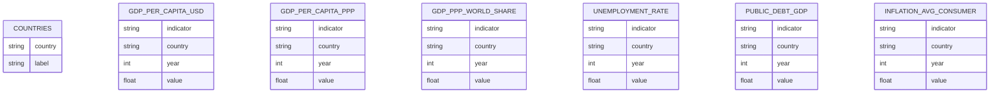
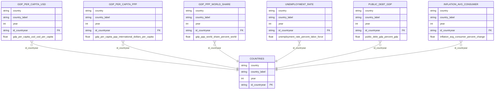
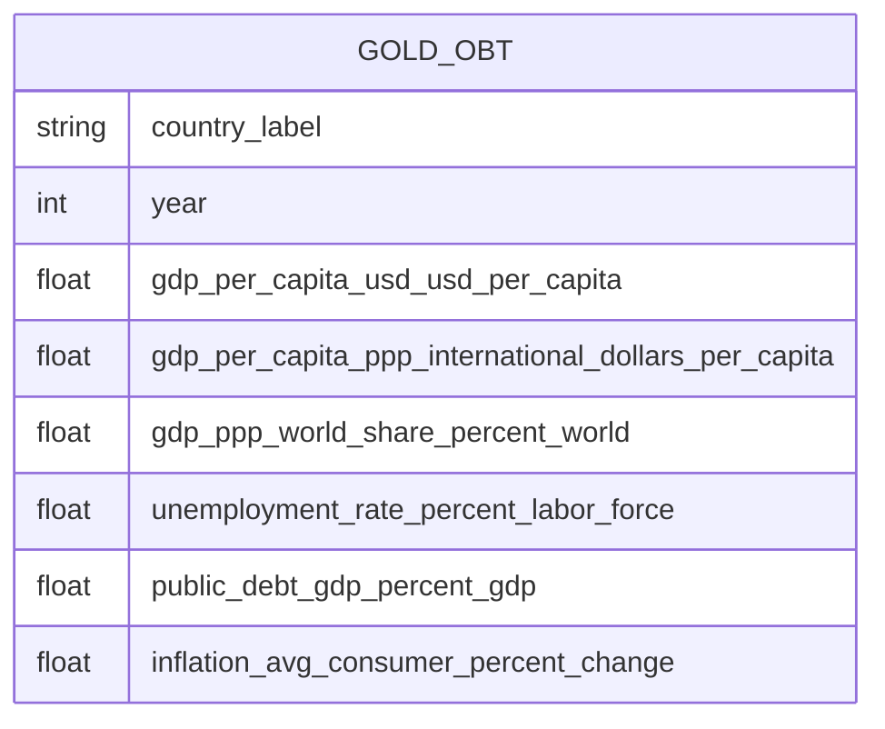

# Transformations Overview

This document summarizes the transformations applied (or expected) when moving data from Bronze to Silver, and how Silver prepares data for Gold.

## Bronze Layer
- No transformation is applied besides converting files from `.json` to `.parquet`.
- The goal is to preserve raw IMF payloads in a columnar format for faster downstream processing.

## Dataset inventory

## Silver Layer (Table-by-table)
The Silver layer standardizes schemas and documents the meaning of the `value` column for each dataset. No unit conversion or scaling is applied; values are kept in their original IMF units.

### Common Rules for Indicator Tables
- Columns: `indicator`, `country`, `country_label`, `year`, `value`, `id_countryear`.
- Types: `year` is coerced to integer, `value` to numeric.
- Missing values are kept as null (no imputation). Quality checks can enforce stricter rules if needed.
- In the ERD below, the `value` column is labeled with table + unit for readability (the physical column name is still `value`).
- `id_countryear` is the concatenation of `country` + `year` (string), used as a stable join key.
- Only `id_countryear` is shown as an explicit FK in the ERD; `country` and `year` are descriptive fields.

### Countries Table
- Table: `countries`
- Columns: `country`, `country_label`, `year`, `id_countryear`.
- The `countries` table is expanded across a fixed year range (1980 → 2030) so each country has one row per year.
- This table acts as the semantic layer: it provides the readable country label and the canonical `id_countryear` key used by all other Silver tables.
- Data quality note: two country codes (`ATI`, `ATL`) can appear with missing labels in the IMF payload; these should be removed or fixed in Silver if they appear.

### Indicator Tables and `value` Units
| Silver Table | Indicator Code | `value` Unit | Notes |
| --- | --- | --- | --- |
| `gdp_per_capita_usd` | `NGDPDPC` | U.S. dollars per capita | Nominal GDP per capita at current prices. |
| `gdp_per_capita_ppp` | `PPPPC` | International dollars per capita | PPP-adjusted GDP per capita. |
| `gdp_ppp_world_share` | `PPPSH` | Percent of world output | PPP-based share of global GDP. |
| `unemployment_rate` | `LUR` | Percent of labor force | Unemployment rate. |
| `public_debt_gdp` | `GGXWDG_NGDP` | Percent of GDP | General government gross debt. |
| `inflation_avg_consumer` | `PCPIEPCH` | Annual percent change | CPI-based inflation rate. |

### Logical/Relational Model (Silver ERD)

**Commentary (How to Read the Relationships)**
All Silver tables share the same grain: one row per `country` + `year`. The shared key `id_countryear` is a concatenation of `country` and `year` (for example, `FRA_2020`). The `countries` table defines the valid country-year grid (1980–2030) and provides the readable label for each country-year. Every indicator table links to `countries` using `id_countryear`.

**Commentary (Model Shape)**
This Silver design looks like an “inverted fact/dimension” model: `countries` is used as the central grid (country + year), while indicator tables hold the measures. It is a valid, pragmatic design when you want a stable country-year backbone and simpler joins in Silver. If you want a more classic star schema, you could later move to a central fact (OBT) with separate `countries` and `years` dimensions.

**Examples**
Example 1: Compare GDP per capita and unemployment for France in 2020.
You would join `gdp_per_capita_usd` with `unemployment_rate` on `id_countryear`, where `id_countryear = FRA_2020`.

Example 2: Build a wide view for reporting.
Start from `countries` (the canonical country-year grid) and LEFT JOIN indicator tables on `id_countryear` to preserve the full country-year backbone, even when one metric is missing.

Example 3: Combine with labels for readability.
Use `country_label` from the `countries` table so the reporting layer always uses consistent country names, while keeping technical join fields out of the final business-facing table.

## Gold Layer
- Gold tables are built by joining Silver indicator tables to the `countries` table on `id_countryear`.
- The goal is to create a single analytics-ready view (OBT) that simplifies downstream reporting (dashboards, tiles, and KPIs).

### One Big Table (OBT)
The Gold layer exposes a single wide table that combines all Silver indicators into one dataset.

**Join logic (Silver → Gold OBT)**
- Grain during construction: one row per `id_countryear` (country + year).
- Base table: `countries` (the canonical grid for 1980–2030).
- Left join each indicator table on `id_countryear` so the OBT preserves the full canonical country-year grid from `countries`.
- `country_label` and `year` come from `countries`.
- `id_countryear` and `country` are used internally for joins, but they are intentionally removed from the final OBT because they are technical fields.
- Result: a single wide, business-friendly table with all indicators aligned by country-year.

| Column | Description |
| --- | --- |
| `country_label` | Full country name from the `countries` table. |
| `year` | Year of the indicator value. |
| `gdp_per_capita_usd_usd_per_capita` | GDP per capita, current prices (USD per capita). |
| `gdp_per_capita_ppp_international_dollars_per_capita` | GDP per capita, PPP (international dollars per capita). |
| `gdp_ppp_world_share_percent_world` | GDP (PPP) share of world output (percent). |
| `unemployment_rate_percent_labor_force` | Unemployment rate (percent of labor force). |
| `public_debt_gdp_percent_gdp` | General government gross debt (percent of GDP). |
| `inflation_avg_consumer_percent_change` | Inflation, average consumer prices (annual percent change). |

